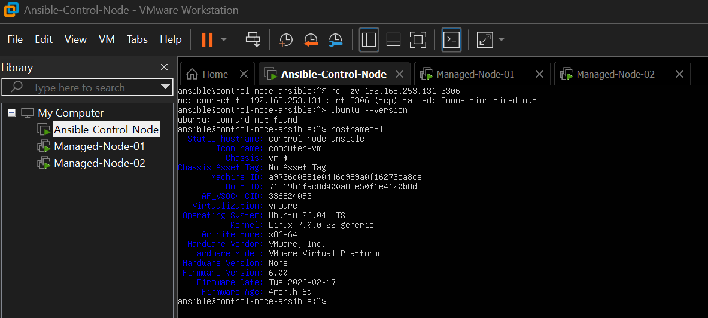
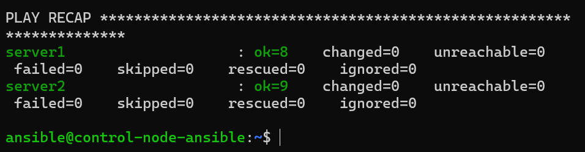
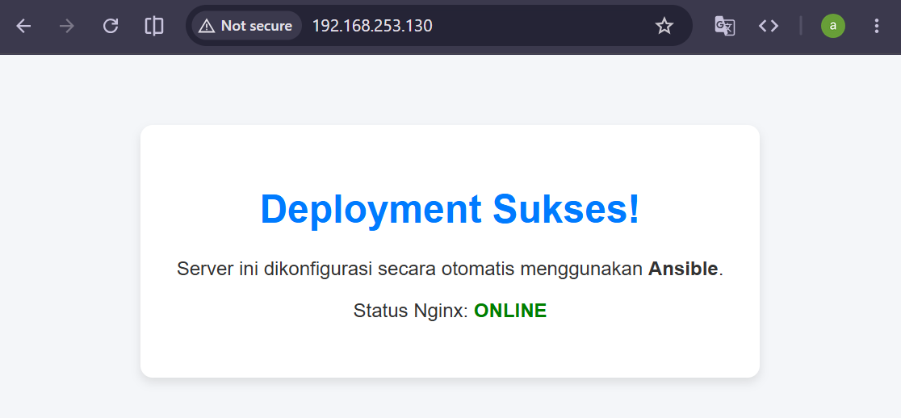
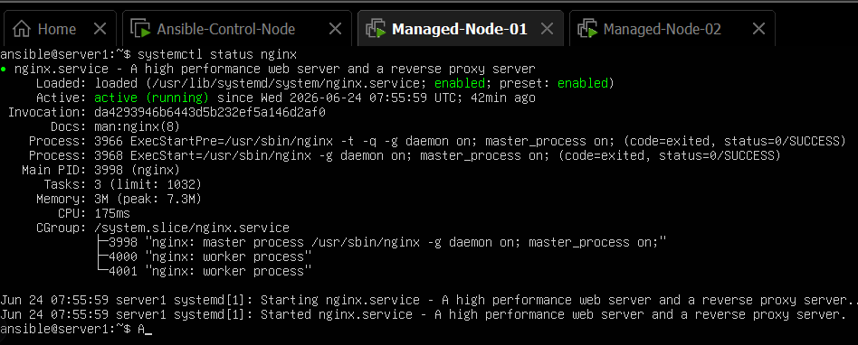
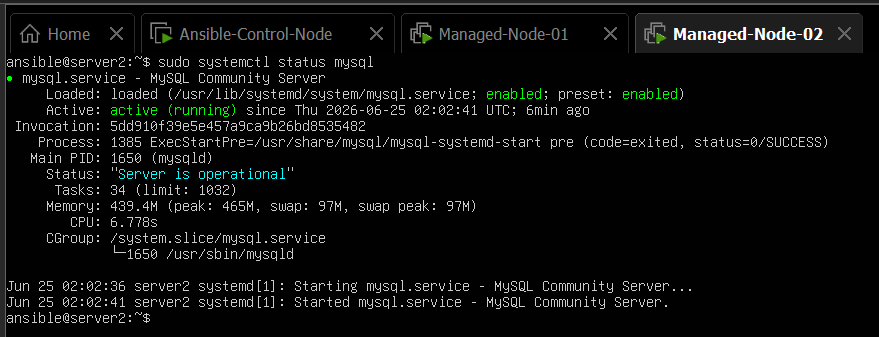
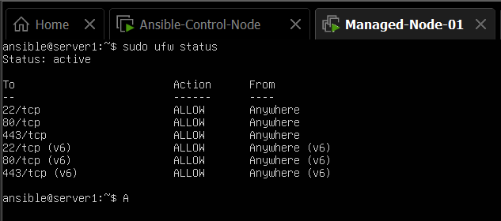
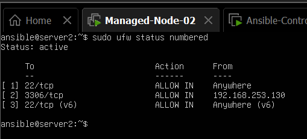
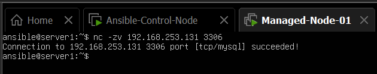
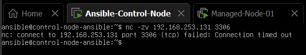

---

# Automated Server Provisioning & Security Hardening with Ansible

## 📖 Project Overview

This project demonstrates Infrastructure as Code (IaC) principles by automating the provisioning and configuration of multiple Linux servers using Ansible.

The environment consists of one Ansible Control Node and two managed servers running on VMware Workstation. The playbook automates operating system updates, software installation, service configuration, web deployment, and firewall hardening.

A multi-tier architecture is implemented by separating the Web Server and Database Server while restricting database access using firewall policies.

---

## 🖥️ Lab Environment


---

## ⭐ Project Highlights

- Provisioned 2 Ubuntu servers from a centralized Ansible Control Node.
- Automated Nginx and MySQL deployment using a single playbook.
- Implemented firewall-based database isolation with UFW.
- Applied Infrastructure as Code (IaC) principles for repeatable deployments.
- Built and tested entirely in a VMware Workstation lab environment.

---

## 🎯 Objectives

* Automate server provisioning using Ansible.
* Deploy a Web Server (Nginx) automatically.
* Deploy a Database Server (MySQL) automatically.
* Configure firewall rules using UFW.
* Implement secure communication between application and database tiers.
* Eliminate repetitive manual server configuration tasks.

---

## 🏗️ Infrastructure Architecture

```text
                         ┌─────────────────────┐
                         │   Control Node      │
                         │      Ansible        │
                         └──────────┬──────────┘
                                    │
                              SSH (22)
                                    │
              ┌─────────────────────┴─────────────────────┐
              │                                           │
              ▼                                           ▼

     ┌──────────────────┐                    ┌──────────────────┐
     │    Web Server    │                    │ Database Server  │
     │ Ubuntu 26.04 LTS │                    │ Ubuntu 26.04 LTS │
     │ Nginx            │                    │ MySQL            │
     │ UFW Firewall     │                    │ UFW Firewall     │
     │ 192.168.253.130  │                    │ 192.168.253.131  │
     └────────┬─────────┘                    └────────┬─────────┘
              │                                       ▲
              │ MySQL (3306)                          │
              └──────────── Allowed Only ─────────────┘

                       HTTP/HTTPS (80,443)
                               │
                               ▼
                           End Users

```

---

## 🛠️ Technology Stack

| Category         | Technology              |
| ---------------- | ----------------------- |
| Automation       | Ansible                 |
| Virtualization   | VMware Workstation      |
| Operating System | Ubuntu Server 26.04 LTS |
| Web Server       | Nginx                   |
| Database         | MySQL                   |
| Firewall         | UFW                     |
| Remote Access    | SSH                     |

---

## 📂 Repository Structure

```text
.
├── screenshots/
│   └── project screenshots
├── inventory.ini
├── playbook.yml
├── server1.html
├── ansible.cfg
├── .gitignore
└── README.md
```

### File Description

| File / Directory | Description                                                        |
| ---------------- | ------------------------------------------------------------------ |
| screenshots/     | Contains project evidence and verification screenshots             |
| inventory.ini    | Defines managed hosts and groups                                   |
| playbook.yml     | Main Ansible automation playbook                                   |
| server1.html     | Custom landing page deployed to Nginx                              |
| ansible.cfg      | Ansible configuration settings                                     |
| .gitignore       | Excludes unnecessary files and sensitive data from version control |
| README.md        | Project documentation                                              |

```
```

## ⚙️ Automated Tasks

### Web Server Configuration

The playbook automatically:

* Updates package repositories.
* Upgrades installed packages.
* Installs Nginx.
* Enables and starts the Nginx service.
* Deploys a custom landing page.
* Configures UFW firewall rules.
* Allows:

  * SSH (22)
  * HTTP (80)
  * HTTPS (443)

### Database Server Configuration

The playbook automatically:

* Updates package repositories.
* Upgrades installed packages.
* Installs MySQL Server.
* Enables and starts the MySQL service.
* Configures UFW firewall rules.
* Allows:

  * SSH (22)
* Restricts MySQL access:

  * TCP 3306 accessible only from the Web Server IP (`192.168.253.130`)
  * Blocks public access to MySQL

---

## 🔒 Security Hardening

### Network Isolation

The database server is not directly accessible from external hosts.
Only the web server is permitted to establish MySQL connections through port 3306.

### Firewall Segmentation

Database access is restricted using UFW firewall rules.

```yaml
- name: Allow MySQL traffic specifically from Server 1 IP
  ufw:
    rule: allow
    from_ip: 192.168.253.130
    port: '3306'
    proto: tcp
```

Only the Web Server can communicate with MySQL.

### Principle of Least Privilege

Only required ports are exposed.

| Server          | Allowed Ports              |
| --------------- | -------------------------- |
| Web Server      | 22, 80, 443                |
| Database Server | 22, 3306 (Web Server only) |

### Information Disclosure Reduction

The default Nginx welcome page is replaced with a custom landing page to minimize unnecessary service information exposure.

---

## 🚀 Deployment

Clone the repository:

```bash
git clone https://github.com/affxplore/ansible-automated-server.git

cd ansible-automated-server
```

Verify inventory configuration:

```bash
cat inventory.ini
```

Run the playbook:

```bash
ansible-playbook -i inventory.ini playbook.yml
```

---

## ✅ Verification & Testing

### Verify Web Server Deployment

Open:

```text
http://192.168.253.130
```

Expected result:

```text
Deployment Successful!
This server was configured automatically using Ansible.
```

Verify Nginx service:

```bash
sudo systemctl status nginx
```

Expected:

```text
active (running)
```

---

### Verify Database Service

```bash
sudo systemctl status mysql
```

Expected:

```text
active (running)
```

---

### Verify Firewall Rules

Web Server:

```bash
sudo ufw status numbered
```

Expected:

```text
22/tcp ALLOW
80/tcp ALLOW
443/tcp ALLOW
```

Database Server:

```bash
sudo ufw status numbered
```

Expected:

```text
22/tcp ALLOW
3306/tcp ALLOW FROM 192.168.253.130
```

---

### Verify Database Isolation

From Web Server:

```bash
nc -zv <database-server-ip> 3306
```

Expected:

```text
Connection succeeded
```

From Host Machine:

```bash
nc -zv <database-server-ip> 3306
```

Expected:

```text
Connection timed out
```

This confirms that the database is protected from unauthorized external access.

---

## 📸 Screenshots

| Description                                        | Evidence                                                                                                |
| -------------------------------------------------- | ------------------------------------------------------------------------------------------------------- |
| Successful Ansible Playbook Execution              |   |
| Custom Nginx Landing Page                          |   |
| Nginx Service Status                               |         |
| MySQL Service Status                               |         |
| UFW Status on Web Server                           |       |
| UFW Status on Database Server                      |  |
| Successful MySQL Connectivity Test from Web Server |        |
| Blocked MySQL Connectivity Test from Host Machine  |        |

---

## 🎯 Key Achievements

- Provisioned and configured 2 managed Ubuntu servers from a dedicated Ansible Control Node.
- Automated deployment of Nginx and MySQL using Ansible Playbooks.
- Reduced manual server configuration tasks through Infrastructure as Code practices.
- Implemented database isolation by restricting MySQL access to trusted hosts only.
- Successfully deployed a secure multi-tier architecture in a VMware Workstation lab environment.

---

## 💼 Skills Demonstrated

* Infrastructure as Code (IaC)
* Configuration Management
* Linux System Administration
* Ansible Automation
* Service Deployment & Management
* SSH Administration
* Firewall Management (UFW)
* Network Segmentation
* Security Hardening
* Multi-tier Architecture Design
* DevOps Fundamentals

---

## 📚 Lessons Learned

Through this project, I learned how to:

* Manage multiple servers from a single control node.
* Automate repetitive Linux administration tasks.
* Deploy and manage web and database services using Ansible.
* Apply Infrastructure as Code principles to improve consistency and repeatability.
* Implement network-level security controls using firewall rules.
* Design a simple but secure multi-tier architecture.

---

## 🗺️ Roadmap

Potential future enhancements include:

### Application Layer

* Deploy a real web application instead of a static HTML page.
* Configure Nginx as a reverse proxy.
* Connect the application directly to MySQL.

### Security

* Enforce SSH key authentication.
* Disable password-based SSH login.
* Implement Fail2Ban for brute-force protection.
* Enable HTTPS with Let's Encrypt certificates.

### Scalability

* Add multiple web servers.
* Implement load balancing using Nginx.
* Configure MySQL replication.

### DevOps Practices

* Integrate GitHub Actions CI/CD pipelines.
* Automate deployment workflows.
* Implement infrastructure validation testing.

### Monitoring & Observability

* Deploy Prometheus for metrics collection.
* Visualize infrastructure health using Grafana.
* Implement centralized logging with ELK Stack or Loki.
* Configure automated alerting.

```
```
